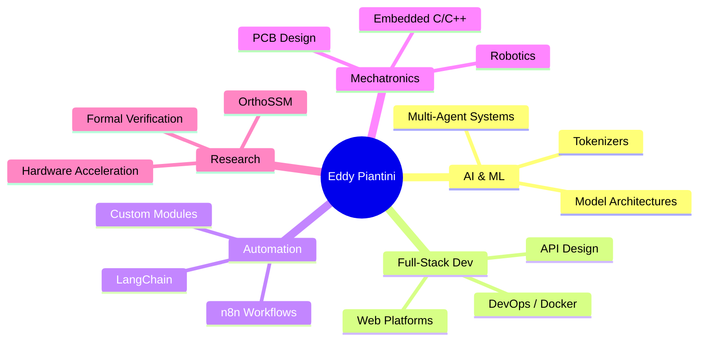

<!-- Header Animation -->
<div align="center">
  
</div>

<br/>

<div align="center">
  <a href="https://github.com/Eddym06">
    
  </a>
  <a href="mailto:eddym062806@gmail.com">
    
  </a>
  <a href="https://github.com/Eddym06/my-portfolio">
    
  </a>
</div>

<br/>

<div align="center">
  
</div>

---

## 👨‍💻 About Me

> Full-Stack Developer & Mechatronics Engineer specialized in **AI Agents** and **automation**. I design complete solutions — from server infrastructure and web platforms to multi-agent AI systems and embedded hardware programming.

```python
class EddyPiantini:
    def __init__(self):
        self.name        = "Eddy Manuel Piantini Martínez"
        self.role        = "Software Developer & Mechatronics Engineer"
        self.location    = "Santo Domingo, Dominican Republic 🇩🇴"
        self.education   = "Instituto Tecnológico de Las Américas (ITLA)"
        self.languages   = ["es_ES (Native)", "en_US (Technical)"]
        self.experience  = "4+ years"
        self.focus       = ["AI Agents", "Automation", "Full-Stack", "Embedded Systems"]

    def say_hi(self):
        print("Thanks for visiting my profile! Let's build something amazing together 🚀")

me = EddyPiantini()
me.say_hi()
```

I'm passionate about solving complex problems through technology — whether it's orchestrating multiple AI agents to collaborate autonomously, building high-performance web platforms, or designing custom hardware solutions. **Proactive, organized, and always pushing the boundaries of what's possible.**

---

## 📊 GitHub Statistics

<div align="center">
  <a href="https://github.com/vn7n24fzkq/github-profile-summary-cards">
    
  </a>
</div>

<div align="center">
  
  
</div>

<div align="center">
  
  
</div>

---

## 🛠️ Tech Stack

### 💬 Languages

<div align="center">


</div>

### ⚡ Frameworks & Tools

<div align="center">


</div>

### 🗄️ Databases

<div align="center">


</div>

### 🔧 Hardware & Electronics

<div align="center">


</div>

---

## 🚀 Featured Projects & Research

<div align="center">

<table>
  <tr>
    <td width="50%">
      <h3 align="center">🤖 AI Development & Research</h3>
      <p align="center">
        Research and development of new AI models (OrthoSSM architecture). Custom tokenizers and collaborative multi-agent orchestration systems.
        <br/><br/>
        
        
        
      </p>
    </td>
    <td width="50%">
      <h3 align="center">⚡ Hardware Optimization (ACF)</h3>
      <p align="center">
        Design proposals for specialized hardware to accelerate complex mathematical computations, leveraging advanced logic verification with Lean 4.
        <br/><br/>
        
        
        
      </p>
    </td>
  </tr>
  <tr>
    <td width="50%">
      <h3 align="center">🦾 Control Systems & Robotics</h3>
      <p align="center">
        Firmware development in C/C++ for embedded systems. Multi-actuator synchronization and wireless interfaces for remote hardware control.
        <br/><br/>
        
        
        
      </p>
    </td>
    <td width="50%">
      <h3 align="center">🔌 PCB & Electronic Design</h3>
      <p align="center">
        Design, routing, and simulation of complex PCBs. Power and magnetics electronics prototyping for mechatronic solutions.
        <br/><br/>
        
        
        
      </p>
    </td>
  </tr>
</table>

</div>

---

## 🎓 Certifications

<div align="center">

| Certification | Issuer |
|:---|:---|
| 🏅 **CSWA — SolidWorks** | Dassault Systèmes |
| 🐍 **Python 1 Fundamentals** | Cisco Networking Academy |
| 🌐 **Networking / IT Fundamentals** | Cisco |
| 🔧 **Automotive Electronics** | Fundación Carlos Slim |
| 💻 **Introduction to Programming** | ITLA (2023) |
| 📊 **Office Applications** | Colegio Santa Teresa (2019) |

</div>

---

## 📈 Contribution Graph

<div align="center">
  
</div>

---

## 🎯 Current Focus



---

<div align="center">

## 🤝 Let's Connect!

I'm always open to collaborating on innovative projects, AI research, automation challenges, or anything at the intersection of software and hardware.

<br/>

<a href="mailto:eddym062806@gmail.com">
  
</a>
<a href="https://github.com/Eddym06">
  
</a>

<br/>
<br/>


</div>

---

<div align="center">
  
</div>

<!--
  ╔══════════════════════════════════════════════════════════╗
  ║  Thanks for stopping by! Feel free to reach out anytime ║
  ╚══════════════════════════════════════════════════════════╝
-->