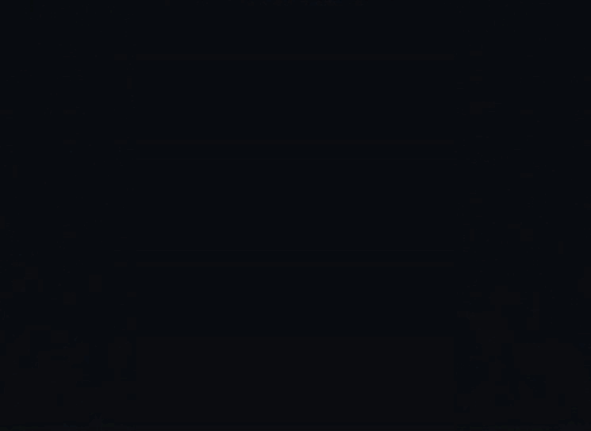
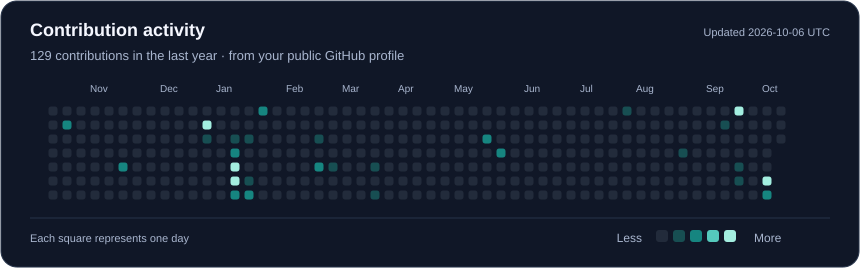
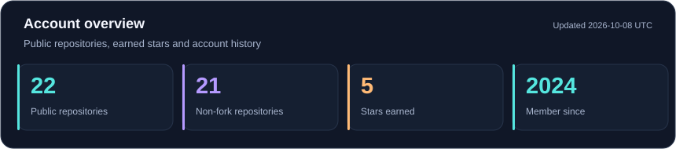
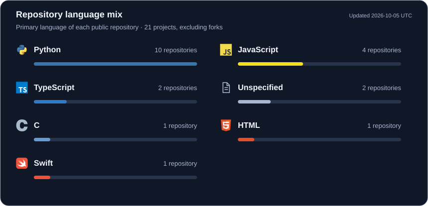

<!-- Digital laboratory · Eddy Manuel · 2026 -->
<picture>
  <source media="(prefers-color-scheme: dark)" srcset="./assets/hero-dark.svg" />
  <source media="(prefers-color-scheme: light)" srcset="./assets/hero-light.svg" />
  
</picture>

  
   
  
  
  
    
  📍 Santo Domingo, Dominican Republic &nbsp; / &nbsp; 🧠 Curious by design &nbsp; / &nbsp; ⚡ Driven to build

 

## 🧬 Behind the code

  <picture>
    <source media="(prefers-reduced-motion: reduce)" srcset="./assets/ascii-portrait-source.png" />
    
  </picture>

I'm **Eddy**, a software developer who likes working where disciplines meet: **AI + automation, software + hardware, research + implementation**. I build web platforms and developer tools, explore model architectures, and look for ways to turn repetitive work into useful systems.

- 🤖 **AI & automation** — multi-agent systems, LLM integrations and n8n workflows.
- 🌐 **Full-stack engineering** — web interfaces, REST APIs, databases and Docker infrastructure.
- 🔬 **Research & systems** — OrthoSSM, custom tokenizers, C/C++, Verilog and FPGA logic.

> **The fun part?** Connecting an idea to something you can actually run.

 

## 🛰️ The build lab

A few things I've been turning from ideas into code. **Click a card to explore.**

<table>
  <tr>
    <td width="50%" valign="top">
      <a href="https://github.com/Eddym06/chrome-devTools-advanced-mcp">
        <picture>
          <source media="(prefers-color-scheme: dark)" srcset="./assets/project-mcp-dark.svg" />
          <source media="(prefers-color-scheme: light)" srcset="./assets/project-mcp-light.svg" />
          
        </picture>
      </a>
      
Connect AI assistants to Chrome through <strong>Model Context Protocol</strong>: browser interaction, inspection and automation.

      
 

    </td>
    <td width="50%" valign="top">
      <a href="https://github.com/Eddym06/n8n-ai-assistant">
        <picture>
          <source media="(prefers-color-scheme: dark)" srcset="./assets/project-n8n-dark.svg" />
          <source media="(prefers-color-scheme: light)" srcset="./assets/project-n8n-light.svg" />
          
        </picture>
      </a>
      
An evolving extension and supporting tools for <strong>creating, validating and improving n8n workflows</strong> with natural language.

      
 

    </td>
  </tr>
  <tr>
    <td width="50%" valign="top">
      <a href="https://github.com/Eddym06/OrthoSSM">
        <picture>
          <source media="(prefers-color-scheme: dark)" srcset="./assets/project-ortho-dark.svg" />
          <source media="(prefers-color-scheme: light)" srcset="./assets/project-ortho-light.svg" />
          
        </picture>
      </a>
      
<strong>Experimental research</strong> into long-context sequence modeling, spectral state compression and GPU kernels.

      
 

    </td>
    <td width="50%" valign="top">
      <h3>🔭 On my research radar</h3>
      
What happens when you rethink the layers underneath an application?

      
I'm interested in <strong>custom tokenizers, hardware acceleration, FPGA logic and formal reasoning with Lean 4</strong> — exploring how models, mathematics and hardware fit together.

      
<code>C / C++</code> <code>Verilog</code> <code>Lean 4</code> <code>CUDA</code>

      
<a href="https://github.com/Eddym06?tab=repositories">Browse the rest of the lab →</a>

    </td>
  </tr>
</table>

 

## 🏆 Python unlocked · freeCodeCamp

**Five projects. One certification milestone.** These are the projects I completed for my **freeCodeCamp Python certification**, covering practical programming, object-oriented design, data structures and recursion.

<picture>
  <source media="(prefers-color-scheme: dark)" srcset="./assets/fcc-dark.svg" />
  <source media="(prefers-color-scheme: light)" srcset="./assets/fcc-light.svg" />
  
</picture>

| | Project | The challenge |
| :---: | :--- | :--- |
| ⚙️ | **[Configuration Manager](https://github.com/Eddym06/fcc-python-configuration-manager)** | Manage and validate user settings with a custom parser. |
| 💸 | **[Budget App](https://github.com/Eddym06/fcc-python-budget-app)** | Track expense categories and generate a spending percentage chart. |
| 📐 | **[Polygon Area Calculator](https://github.com/Eddym06/fcc-python-polygon-area-calculator)** | Model rectangles and squares with object-oriented Python. |
| 🗂️ | **[Hash Table](https://github.com/Eddym06/fcc-python-hash-table)** | Build a hash table and handle collisions. |
| 🗼 | **[Tower of Hanoi](https://github.com/Eddym06/fcc-python-tower-of-hanoi)** | Solve the classic puzzle with a recursive algorithm. |

 

## ⚡ My engineering toolkit

  
<strong>WRITE THE LOGIC</strong>

  
    
  
<strong>BUILD &amp; SHIP</strong>

  
    
  
<strong>GO DEEPER</strong>

  
  
  
  
  

 

## 📡 GitHub telemetry

  <picture>
    <source media="(prefers-color-scheme: dark)" srcset="./assets/github-activity-dark.svg" />
    <source media="(prefers-color-scheme: light)" srcset="./assets/github-activity-light.svg" />
    
  </picture>
   
  <picture>
    <source media="(prefers-color-scheme: dark)" srcset="./assets/github-stats-dark.svg" />
    <source media="(prefers-color-scheme: light)" srcset="./assets/github-stats-light.svg" />
    
  </picture>
    
  <picture>
    <source media="(prefers-color-scheme: dark)" srcset="./assets/github-languages-dark.svg" />
    <source media="(prefers-color-scheme: light)" srcset="./assets/github-languages-light.svg" />
    
  </picture>
   
  Public GitHub profile and repository data · refreshed daily by GitHub Actions · contribution activity reflects what GitHub shows publicly

 

---

  <h3>💬 Your next idea could start a good conversation.</h3>
  
Developer tools, AI research, automation, or an interesting engineering challenge.

  
    
  <a href="mailto:eddym062806@gmail.com">eddym062806@gmail.com</a>
    
  <code>build → experiment → understand → repeat</code>
    
  Made of curiosity, code and a little Caribbean energy. 🇩🇴 · 2026

<!-- Artwork: tools/generate-art.mjs, tools/generate-ascii-portrait.py and tools/update-github-telemetry.mjs. External artwork: readme-typing-svg, skill-icons and Shields.io. -->
